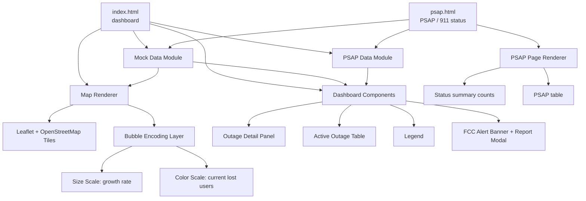
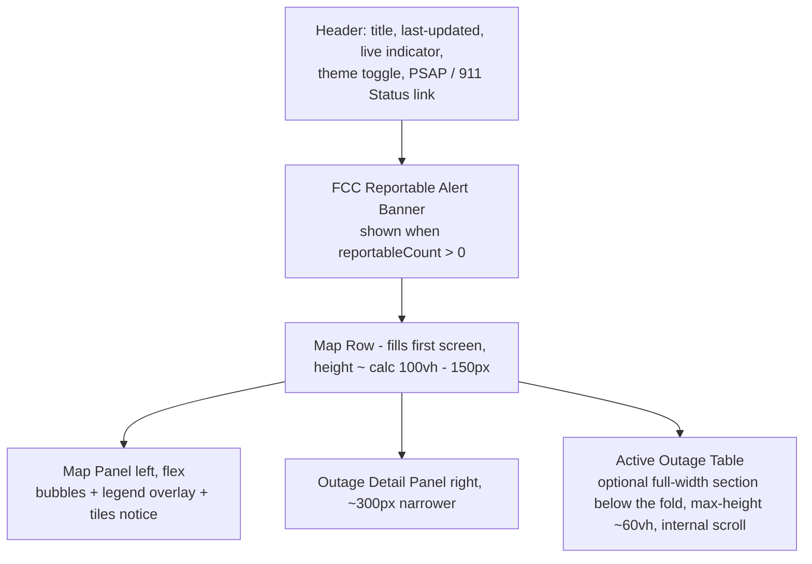

# Design Document: Outage Dashboard Mockup

## Overview

The Outage Dashboard Mockup is a self-contained, visually polished web dashboard that presents information about active service outages. It is a *demonstration artifact* driven entirely by realistic mock data — there is no live backend, API, or streaming source. Its purpose is to communicate a specific data-visualization concept clearly and attractively.

### Business Context

This mockup is built for **Spectrum (Charter Communications)**. It presents Spectrum's own **outage operations view** — outage information drawn from the **single Spectrum network**. This has concrete implications for the design:

- Every outage belongs to a single **network/brand source** — always **"Spectrum"** — so the dashboard is a single-network view.
- The dashboard framing conveys Spectrum's operations picture: the **title/header** reflects **"Spectrum"** branding. A per-network lost-user breakdown is still computed in the summary aggregates, but with a single network it simply equals the total lost users.

The map centers on and frames the **United States**, with mock outages distributed across major US cities and regions, reflecting Spectrum's domestic footprint.

The centerpiece is an interactive geographic map on which each active outage is rendered as a bubble. The bubble uses a **dual encoding**:

- **Bubble size** encodes the *rate of increasing lost users* — how fast the outage is growing (users lost per minute). A bigger bubble means the outage is escalating faster.
- **Bubble color** encodes the *current total number of lost users* — a sequential color scale from cool/low to hot/high.

The color scale is deliberately anchored to the **FCC / 911 reporting threshold**. When an outage's current lost users reaches **~900,000**, the operator is obligated to report the outage to the **FCC** and to **PSAP/911** operators. The bubble **color therefore encodes closeness to this 900k threshold** — deep red means the outage is at or over the threshold. Beyond color, the dashboard explicitly **flags** any outage that has crossed the threshold as **"reportable"** (a shared constant `FCC_REPORT_THRESHOLD = 900000` defines both the color-scale max and the reportable cutoff), surfacing it through an alert banner, a map ring, a table badge, and a badge in the outage detail panel so operators cannot miss a reporting obligation. Operators can click the alert banner to open a **details modal** that explains the reporting obligation and lists the currently reportable outages.

**The map is the hero of the redesign.** Around it, the dashboard is "fleshed out" with supporting elements — a header (with a light/dark theme toggle and a link to the PSAP / 911 status page), an FCC alert banner, an **outage detail panel** that shows the full record for the selected outage (including its PSAP / 911 reporting status), an active-outage table, severity indicators, timestamps, and a legend that explains the bubble encoding. The five KPI summary cards and the total-lost-users trend sparkline from the earlier design have been **removed**. Visual polish and conceptual clarity are the primary goals.

Selecting an outage — by clicking its map bubble **or** its row in the outage table — populates the detail panel with that outage's name, network (Spectrum), region, severity, current lost users, growth rate, start time, an FCC-reportable badge, and a **PSAP / 911** section. A companion **PSAP / 911 status page** (`psap.html`) lists every PSAP and its 911 reporting status.

The dashboard also feels **live**: a low-frequency timer gently drifts current lost-user counts and growth rates, and the map bubbles, the active-outage table, the selected outage's detail panel, and the last-updated timestamp all update in response. Live drift is a first-class described behavior of this mockup, not an optional extra.

This design favors a small set of **self-contained, buildless HTML files** using vanilla HTML/CSS/JavaScript plus a small, well-established mapping library (on the dashboard page only), so the mockup can be opened directly in any browser with no build step.

## Architecture

### Technology Approach

The mockup is delivered as two buildless pages that share `styles.css` and the logic modules:

- **`index.html`** — the dashboard (Leaflet map hero + detail panel + active-outage table).
- **`psap.html`** — the PSAP / 911 status page (no map; summary counts + PSAP table).

Both run entirely client-side, loading their modules via plain `<script>` tags (no ES-module imports, which fail over `file://`). Each logic module attaches to a browser global (e.g. `window.MockData`, `window.PsapData`, `window.DetailPanel`).



### Mapping Library Choice: Leaflet + OpenStreetMap (Recommended)

Two realistic options were considered:

| Option | Pros | Cons |
|--------|------|------|
| **Leaflet + OSM tiles** (recommended) | Mature, tiny (~40KB), free tiles, real geography gives instant credibility, easy circle markers with pixel/meter radius, pan/zoom for free | Requires network access for tiles, external CDN dependency |
| **Inline SVG map** | Fully offline, zero dependencies, total styling control | Must supply/trace map geometry, no pan/zoom without extra work, less "real", more custom code |

**Recommendation: Leaflet with OpenStreetMap tiles.** For a mockup whose goal is to *look* polished and credible, a real slippy map with pan/zoom sells the concept far more effectively than a hand-drawn SVG, and Leaflet's `L.circleMarker` maps cleanly onto the bubble-encoding requirement (radius = growth rate, fillColor = current lost users). The tradeoff is a CDN/network dependency for tiles; this is acceptable for a demo. The design isolates the map behind a small renderer interface so an SVG fallback could be substituted later without touching the encoding logic.

### Layout

**The map is the hero — it fills roughly the whole first screen.** On wide screens the dashboard is a vertical stack that **scrolls normally** (there is no fixed `100vh` / `overflow: hidden` sizing):

1. **Header** spanning the top — "Spectrum" branding, last-updated timestamp, live indicator, a **light/dark theme toggle**, and a **"PSAP / 911 Status" navigation link** to `psap.html`.
2. **FCC reportable alert banner** directly below the header, shown only when any outage is reportable (`reportableCount > 0`).
3. **Map row** — the main content, sized to fill approximately the whole first screen (**map row height ≈ `calc(100vh - ~150px)`**, leaving room for the header/banner). It contains the **Leaflet map on the left (flex, filling the available width)** and, on the right, a **narrower fixed-width (~300px) outage detail panel**. The map keeps its **legend overlay** (with a minimize toggle) and the **tiles-unavailable notice** on top of it.
4. **Active outage table** — an **optional full-width section below the map row, below the fold**, that the user scrolls down to reach. It has a **`max-height` of ~60vh with internal scroll**.

On narrow screens (`<= 1024px`) the map row's columns stack and the page continues to scroll normally.

The five KPI summary cards and the trend sparkline are no longer part of the layout.



> **Layout note:** the map row fills the viewport as the hero; the active outage table lives **below the fold** and is reached by scrolling down. The page uses normal document scrolling rather than fixed-height viewport panels.

## Components and Interfaces

### Component 1: Mock Data Module

**Purpose**: Provides a realistic, static seed set of outage records plus derived aggregate values, and drives the **live drift** behavior that keeps the dashboard feeling alive.

**Interface**:
```javascript
// Returns the full seed set of mock outages, distributed across US cities,
// each tagged with the single network source ("Spectrum")
function getMockOutages(): Outage[]

// Computes dashboard-level aggregates from a list of outages, including the
// single-network (Spectrum) lost-user breakdown and the reportableCount
// (outages at/over the FCC 900k threshold)
function computeSummary(outages: Outage[]): DashboardSummary

// Returns a slightly mutated copy to simulate live updates; called on a timer
function tickOutages(outages: Outage[]): Outage[]
```

**Responsibilities**:
- Define a fixed seed set of outages distributed across major **US cities/regions** (e.g., New York, Los Angeles, Chicago, Dallas, Atlanta, Phoenix, Seattle), with varied severity, growth rate, and lost-user counts.
- Tag each outage with its **network source** (always "Spectrum") — the dashboard is a single-network view.
- Compute totals (active outage count, total lost users, peak growth rate) plus the **single-network lost-user breakdown** (which equals the total for the sole Spectrum network).
- **Live drift (enabled):** `tickOutages` gently mutates each outage's `currentLostUsers` and `growthRatePerMin` by small deltas on every tick, so counts wander realistically up and down over time. It is invoked on a **low-frequency timer (every few seconds)**; after each tick the summary is recomputed and the **map bubbles, the active outage table, the selected outage's detail panel, and the last-updated timestamp** are refreshed (there are no longer KPI cards or a sparkline to update). Drift keeps values within valid bounds (never negative) so the dashboard stays stable.

### Component 2: Bubble Encoding Layer

**Purpose**: Converts an outage's numeric fields into visual properties (radius in pixels, fill color) using explicit, documented scales.

**Interface**:
```javascript
// Maps growth rate (users lost per minute) to a bubble radius in pixels
function radiusForGrowthRate(growthRatePerMin: number): number

// Maps current total lost users to a color on the sequential scale
function colorForLostUsers(currentLostUsers: number): string

// Produces legend reference entries (sample sizes and color stops)
function getLegendModel(): LegendModel
```

**Responsibilities**:
- Own the size scale (growth rate → radius), clamped to a sensible min/max so bubbles are always visible and never overwhelm the map.
- Own the color scale (current lost users → color) across defined thresholds/stops.
- Guarantee the legend is generated from the *same* scale functions so it always matches what is drawn.

### Component 3: Map Renderer

**Purpose**: Initializes the map and renders/updates outage bubbles and their popups.

**Interface**:
```javascript
function initMap(containerId: string): MapHandle
function renderOutages(map: MapHandle, outages: Outage[]): void
function updateOutages(map: MapHandle, outages: Outage[]): void
// Registers a callback invoked with the outage record when its bubble is
// clicked; passing null clears it. Wired by app.js to drive the detail panel.
function setSelectHandler(fn: (outage: Outage) => void | null): void
```

**Responsibilities**:
- Initialize Leaflet with OSM tiles **framing the continental United States** (initial center near ~39.5°N, ~-98.35°W with a zoom level of ~4 that shows the lower 48 states). All mock outages fall within this view.
- For each outage, draw a `circleMarker` whose radius and fillColor come from the Bubble Encoding Layer.
- **Reportable bubbles** (`isReportable(outage)` true, i.e. `currentLostUsers >= 900k`) render with a **pulsing red ring** around the bubble so at/over-threshold outages stand out at a glance.
- Attach a popup/tooltip per bubble showing outage details (name, location, **network source (Spectrum)**, lost users, growth rate, severity, start time). For reportable outages the popup additionally shows an **"FCC REPORTABLE (>= 900k)"** flag.
- **Bubble selection:** clicking a bubble invokes the callback registered via `setSelectHandler`, which selects that outage and renders it in the **outage detail panel** (the popup toggle remains as a secondary quick on-map summary).
- On each live-drift tick, update existing bubbles' radius/fillColor in place so the map animates smoothly, and add/remove the pulsing ring and popup flag as outages cross the threshold.

### Component 4: Dashboard Components (Table, Legend, Header, Banner, Modal)

**Purpose**: Render the supporting, non-map UI from the same data. (The outage detail panel is described separately in Component 5.)

**Interface**:
```javascript
function renderOutageTable(outages: Outage[]): void        // FCC badge + tinted row for reportable; rows carry data-outage-id
function renderLegend(legend: LegendModel): void
function renderHeader(summary: DashboardSummary, lastUpdated: Date): void  // hosts theme toggle + PSAP link
function renderReportableBanner(summary: DashboardSummary, outages: Outage[]): void  // shown when reportableCount > 0

// Report Details Modal (window.ReportModal in the implementation)
interface ReportModal {
  open(outages: Outage[]): void      // open, populated from current reportable outages
  close(): void                      // dismiss the modal
  refresh(outages: Outage[]): void   // re-populate while open (on each live-drift tick)
  isOpen(): boolean
}
```

**Responsibilities**:
- Outage table: rendered as an **optional full-width section below the map row (below the fold, `max-height` ~60vh)** with internal scroll. Rows show name, region, **network (Spectrum)**, lost users, growth rate, severity chip, and start time. **Reportable rows** (`isReportable` true) show an **"FCC" badge** next to the outage name and are rendered with a **tinted row** background so they are visually distinguished. Each row carries a **`data-outage-id`** attribute; a delegated click handler (in `app.js`) selects that row's outage and renders it in the detail panel, applying an `.is-selected` highlight to the row.
- Legend: bubble size samples (slow/medium/fast growth) and the color gradient with labeled thresholds (hot end labeled "FCC report (900k)"). It renders as an **overlay on the map** with a minimize toggle.
- Header: "Spectrum" title/branding plus a live-updating last-updated timestamp and a live indicator. The header also hosts a **light/dark theme toggle** and a **"PSAP / 911 Status" navigation link** to `psap.html` (see FCC Reportable Alert Banner and Theme below).

> **Removed in this redesign:** the five KPI summary cards (`renderKpiCards`) and the total-lost-users trend sparkline (`renderTrendSparkline`) are no longer part of the dashboard. `computeSummary` still returns `reportableCount` (consumed by the FCC alert banner and the FCC report modal) along with `mostSevereRegion` and `lostUsersByNetwork`, but these are no longer surfaced as KPI cards.
- **FCC Reportable Alert Banner**: a banner rendered at the top of the dashboard, directly below the header, that **appears only when one or more outages are reportable** (`reportableCount > 0`). It shows the reportable count and the names of the affected outages, and **hides entirely when no outages are reportable**. It re-evaluates on each live-drift tick as outages cross or fall back below the threshold.
- All components (table, banner, and the selected outage's detail panel) re-render on each live-drift tick so the displayed values stay in sync with the drifting data.

- **Report Details Modal** (`window.ReportModal`): a modal opened by clicking the **FCC Reportable Alert Banner**. It displays: an explanation of the FCC / 911 reporting obligation (report to **FCC NORS** and notify **PSAP / 911** when an outage reaches `>= 900k` lost users), a **table of the currently reportable outages sorted by current lost users descending** (columns: outage name, network, region, current lost users, amount over the 900k threshold, growth rate, started time), and a **recommended-actions checklist**. It is **dismissible** via a close button, a backdrop click, or the **Escape** key, shows an **empty state** when nothing is reportable, and **refreshes on each live-drift tick while open** so the listed outages stay in sync as they cross or fall back below the threshold.

**Theme (light/dark toggle)**: the dashboard defaults to a dark theme and offers a **light/dark theme toggle in the header**. The selected theme is **persisted** (e.g., localStorage) so it survives reloads. This is purely presentational and does not affect the data model or encodings.

### Component 5: Outage Detail Panel

**Purpose**: The right-hand panel of the map row. It shows the full record for the currently-selected outage, including its PSAP / 911 reporting status — the key new information this redesign surfaces. It is the primary detail view now that map popups are secondary.

**Interface** (`window.DetailPanel` in the implementation):
```javascript
function render(outage: Outage): void   // render full details for the selected outage
function renderEmpty(): void            // render the "select an outage" prompt
```

**Responsibilities**:
- **Empty state:** on load, and whenever no outage is selected, `renderEmpty` shows a prompt inviting the operator to select an outage on the map or in the table.
- **Selected state:** `render(outage)` shows the outage's name, a **network chip** (Spectrum), region, a **severity chip**, **current lost users**, **growth rate** (users/min), **started** time, an **FCC-reportable badge** (present when `isReportable(outage)` is true, i.e. `currentLostUsers >= 900k`), and a **PSAP / 911 section**.
- **PSAP / 911 section:** resolves the outage's linked PSAP (via the outage's `psapId`, falling back to a `linkedOutageId` match) from `window.PsapData` and shows a **"Reported to PSAP / 911"** value plus the PSAP name, status badge, and county/state. When no PSAP is linked it notes that no linked PSAP record exists. It also links to the PSAP / 911 status page.
- **"Reported to PSAP / 911" value — single source of truth:** this value is driven **solely by the linked PSAP record's `status`**, so the detail panel and the PSAP page always agree:
  - **"Yes"** when status is `notified` or `acknowledged`,
  - **"No"** when status is `pending`,
  - **"Not required"** when status is `not_required` (or no PSAP is linked).
  The FCC-reportable badge is a **separate** flag based on the 900k threshold; PSAP notification can happen independently of that flag.

**Selection wiring** (assembled in `app.js`):
- The Map Renderer's `setSelectHandler(fn)` is wired so clicking a bubble selects that outage.
- The outage table's rows carry a `data-outage-id`; a delegated click handler selects the row's outage (the table body is re-rendered every tick, so delegation is required).
- Selecting an outage records its id, renders it via `DetailPanel.render`, and highlights the matching table row.
- On each live-drift tick the selected outage is **re-resolved from the updated list** and its detail panel is refreshed; if the outage no longer exists, the panel **reverts to the empty state** and the selection is cleared.

### Component 6: PSAP Page Renderer

**Purpose**: Renders the standalone **PSAP / 911 status page** (`psap.html`) — a second buildless page (no Leaflet) that gives operators a single view of every PSAP and its 911 reporting status.

**Interface** (`window.PsapPage` in the implementation):
```javascript
function render(): void        // render summary counts + PSAP table
function buildRows(): Row[]     // join PSAPs to their linked outage, sorted by actionability
```

**Responsibilities**:
- Reuses `styles.css` and loads `constants.js`, `mockData.js`, `psapData.js`, and `psapPage.js` (no map libraries).
- **Summary counts by status:** a row of tiles showing the count of PSAPs per status — **Acknowledged / Notified / Pending / Not required**.
- **PSAP table:** one row per PSAP joined to its linked outage, with columns: PSAP name, county/state, linked outage name, that outage's current lost users, a **status badge**, phone, and last updated. Rows are **sorted so the most actionable statuses surface first** (`pending`, then `notified`, then `acknowledged`, then `not_required`); ties break by descending linked-outage lost users.
- **Color-coded status badges:** `acknowledged` = green, `notified` = blue, `pending` = amber, `not_required` = grey. The same badge styling is reused by the detail panel's PSAP section.
- **Shared header:** the same "Spectrum" header with the theme toggle and a **back-to-dashboard link** (instead of the dashboard's PSAP link).

## Data Models

### Model 1: Outage

```javascript
interface Outage {
  id: string                 // unique identifier, e.g. "otg-001"
  name: string               // human label, e.g. "API Gateway Degradation"
  network: Network           // originating network/brand -> always "Spectrum"
  region: string             // display region/city, e.g. "Dallas, TX"
  lat: number                // latitude for map placement (US-centric)
  lng: number                // longitude for map placement (US-centric)
  currentLostUsers: number   // CURRENT total lost users -> drives COLOR
  growthRatePerMin: number   // lost users per minute -> drives SIZE
  severity: Severity         // categorical severity for chips/labels
  startedAt: string          // ISO 8601 timestamp when outage began
  status: "active"           // mockup shows active outages
  psapId: string             // links this outage to its PSAP / 911 record (see Model 5)
}

type Severity = "critical" | "major" | "minor"
type Network = "Spectrum"
```

**Validation Rules**:
- `network` is exactly `"Spectrum"` (the single network)
- `currentLostUsers >= 0`
- `growthRatePerMin >= 0`
- `lat` in [-90, 90], `lng` in [-180, 180]; mock records fall within the continental US bounding box
- `id` unique across the dataset
- `startedAt` is a valid ISO 8601 timestamp not in the future
- `psapId` references the `id` of exactly one PSAP record (Model 5)

**Derived helper — `isReportable`**:

A pure helper flags whether an outage has crossed the FCC / 911 reporting threshold:

```javascript
// True when the outage must be reported to the FCC and PSAP/911 operators.
isReportable(outage) === outage.currentLostUsers >= FCC_REPORT_THRESHOLD  // 900000
```

This single predicate is reused everywhere the UI needs to flag an outage (map ring, popup flag, table badge/tint, detail-panel FCC badge, alert banner), so all "reportable" affordances stay anchored to the same 900k constant.

### Model 2: DashboardSummary

```javascript
interface DashboardSummary {
  activeOutageCount: number       // count of active outages
  totalLostUsers: number          // sum of currentLostUsers (single-network view)
  peakGrowthRatePerMin: number    // max growthRatePerMin across outages
  mostSevereRegion: string        // region of the highest-impact outage
  reportableCount: number         // count of outages at/over the FCC 900k threshold
  lostUsersByNetwork: {           // single-network breakdown (Spectrum only)
    Spectrum: number              // sum of currentLostUsers where network == "Spectrum"
  }
}
```

**Validation Rules**:
- `activeOutageCount` equals the number of outages provided.
- `totalLostUsers` equals the sum of each outage's `currentLostUsers`.
- `peakGrowthRatePerMin` equals the maximum `growthRatePerMin`, or 0 when there are no outages.
- `reportableCount` equals the number of outages whose `currentLostUsers >= FCC_REPORT_THRESHOLD` (900k) — equivalently, the count of outages for which `isReportable` is true; 0 for an empty list.
- `lostUsersByNetwork.Spectrum` equals the sum of `currentLostUsers` over outages with `network == "Spectrum"`. Since Spectrum is the only network, this is a single-network partition: `lostUsersByNetwork.Spectrum` equals `totalLostUsers`.

### Model 3: LegendModel

```javascript
interface LegendModel {
  sizeSamples: { label: string; growthRatePerMin: number; radiusPx: number }[]
  colorStops: { label: string; lostUsers: number; color: string }[]
}
```

**Validation Rules**:
- Each `radiusPx` in `sizeSamples` equals `radiusForGrowthRate(growthRatePerMin)` for the same input.
- Each `color` in `colorStops` equals `colorForLostUsers(lostUsers)` for the same input.

### Model 4: TrendPoint (removed — no longer used)

The trend sparkline was removed in the redesign, so this model is **no longer used** by the mockup. It is retained here only for historical reference:

```javascript
// NO LONGER USED — the total-lost-users trend sparkline was removed.
interface TrendPoint {
  t: string        // ISO 8601 timestamp
  totalLostUsers: number
}
```

### Model 5: PSAP

A PSAP (Public Safety Answering Point) record represents the 911 authority for an outage's region and carries the reporting status that drives both the detail panel's PSAP section and the PSAP status page. PSAP records are **mock data**, provided by `getPsaps()` (`window.PsapData`).

```javascript
interface PSAP {
  id: string               // unique identifier, e.g. "psap-001"
  name: string             // e.g. "New York City PSAP"
  county: string           // e.g. "New York County"
  state: string            // 2-letter state, e.g. "NY"
  phone: string            // display phone, e.g. "911 / +1-212-555-0101"
  status: PsapStatus       // 911 reporting status (single source of truth)
  linkedOutageId: string   // id of the outage this PSAP covers
  updatedAt: string        // ISO 8601 timestamp of the last status update
}

type PsapStatus = "acknowledged" | "notified" | "pending" | "not_required"
```

**Validation Rules**:
- `status` is exactly one of `"acknowledged" | "notified" | "pending" | "not_required"`.
- `linkedOutageId` references the `id` of an outage (Model 1), and that outage's `psapId` references this PSAP's `id` (the link is symmetric).
- `updatedAt` is a valid ISO 8601 timestamp in the recent past.
- `id` unique across the dataset.

**Status → "Reported to PSAP / 911" mapping** (single source of truth, reused by both the detail panel and the PSAP page):
- `notified` / `acknowledged` → **"Yes"**
- `pending` → **"No"**
- `not_required` → **"Not required"**

## Encoding Scheme (Core Concept)

### Size Scale — Growth Rate → Radius

Growth rate (users lost per minute) maps to bubble radius in pixels. The scale is clamped so bubbles remain legible:

- Minimum radius: ~8px (even a barely-growing outage is visible).
- Maximum radius: ~40px (a runaway outage is prominent but does not swamp the map).
- Mapping is monotonic increasing (a faster-growing outage is never drawn smaller than a slower one). A square-root or linear interpolation between clamp bounds is used so area scales perceptually with rate.

### Color Scale — Current Lost Users → Color

Current total lost users maps to the **classic yellow → orange → deep red sequential heat ramp** (confirmed). The domain runs **0 → 900,000**, where 900,000 is the **FCC / 911 reporting threshold**. Low current impact (0) renders as yellow, escalating through orange, up to **deep red at/above 900k**, so the reddest bubbles are precisely those at or over the reporting obligation. Values at/above the max clamp to the deep-red endpoint. A shared constant **`FCC_REPORT_THRESHOLD = 900000`** defines both the color-scale max (`LOST_USERS_DOMAIN.max`) and the reportable cutoff, keeping color and the "reportable" flag anchored to the same number. Thresholds are defined and reused by the legend. The mapping is monotonic (more lost users never yields a "cooler" color than fewer).

### Legend

A legend overlay explains both encodings: labeled sample bubbles (slow / medium / fast growth) for size, and a labeled gradient bar with threshold values for color. The color gradient's **hot end is labeled "FCC report (900k)"** so the meaning of deep red is explicit. The legend is generated from the same scale functions the map uses, guaranteeing consistency.

## Error Handling

### Error Scenario 1: Map tiles fail to load (offline / CDN blocked)
**Condition**: Network unavailable so OSM tiles cannot be fetched.
**Response**: The map container shows a neutral background and a small "map tiles unavailable" notice; bubbles and all surrounding dashboard components still render from mock data.
**Recovery**: Reloading when connectivity returns restores tiles; no data is lost since everything is local mock data.

### Error Scenario 2: Empty or missing outage data
**Condition**: The mock dataset is empty.
**Response**: the table shows an empty-state message, the detail panel shows its "select an outage" prompt, and the map renders with no bubbles rather than erroring.
**Recovery**: N/A — the dashboard remains stable and readable.

### Error Scenario 3: Out-of-range or malformed outage record
**Condition**: A record has invalid coordinates or negative counts.
**Response**: The renderer skips the invalid bubble and clamps out-of-range visual values to scale bounds so a bad record cannot break the view.
**Recovery**: Other records render normally.

## Testing Strategy

### Unit Testing Approach
Test the pure logic that has clear input/output: `computeSummary` aggregates, the size scale, the color scale, and legend/scale consistency. Test empty-data and out-of-range edge cases.

### Property-Based Testing Approach
Property tests target the pure encoding and aggregation functions, where behavior varies meaningfully with input across a large numeric space.

**Property Test Library**: fast-check (JavaScript/TypeScript).

Candidate properties: summary totals equal sums/counts of inputs; size scale monotonicity and clamping within [minR, maxR]; color scale monotonicity across thresholds; legend entries match the scale functions.

### Integration / Rendering Approach
Rendering of the map and DOM components is verified with a small number of example-based checks (bubble count equals outage count, table/detail-panel text reflects the selected outage), not property tests.

## Performance Considerations

The dataset is small (a handful to a few dozen mock outages), so rendering is trivial. The only external cost is OSM tile loading, which is standard for Leaflet. Live drift is enabled and uses a low-frequency timer (every few seconds), updating bubbles in place rather than tearing down and rebuilding the layer, so CPU cost stays minimal.

## Security Considerations

This is a static, read-only mockup with no backend, authentication, user input, or data persistence, so the attack surface is minimal. Mock data is inlined, not fetched from untrusted sources. The only external resources are the Leaflet library and OSM tiles loaded over HTTPS from reputable CDNs.

## Dependencies

- **Leaflet** (~1.9.x, vendored locally under `lib/`) — map rendering and circle markers on the **dashboard page only**. The **PSAP / 911 status page (`psap.html`) needs no map** and does not load Leaflet.
- **OpenStreetMap tiles** via HTTPS — base map imagery (dashboard page only).
- **Mock data providers** — `window.MockData` (`getMockOutages`) and `window.PsapData` (`getPsaps`) supply the outage and PSAP mock datasets; both pages read from these globals, so the detail panel and the PSAP page draw the PSAP status from the same source.
- No build tooling, framework, or package manager required; both pages open directly in a browser.
- (Testing only) **fast-check** and a JS test runner (e.g., Vitest) for the pure logic extracted into testable modules.

## Correctness Properties

*A property is a characteristic or behavior that should hold true across all valid executions of a system — essentially, a formal statement about what the system should do. Properties serve as the bridge between human-readable specifications and machine-verifiable correctness guarantees.*

### Property 1: Summary totals reflect the data

For any list of valid outages, `computeSummary` produces `activeOutageCount` equal to the number of outages, `totalLostUsers` equal to the sum of each outage's `currentLostUsers`, and `peakGrowthRatePerMin` equal to the maximum `growthRatePerMin` (or 0 for an empty list).

**Validates: Requirements 7.1, 7.2, 7.3, 7.4**

### Property 2: Size scale is monotonic and bounded

For any two growth rates a and b with a <= b, `radiusForGrowthRate(a) <= radiusForGrowthRate(b)`, and for any growth rate the returned radius lies within the defined [minRadius, maxRadius] bounds.

**Validates: Requirements 2.1, 2.2, 2.3, 14.4**

### Property 3: Color scale is monotonic

For any two current-lost-user counts a and b with a <= b, `colorForLostUsers(b)` is at least as "hot" as `colorForLostUsers(a)` on the defined sequential ramp (never cooler).

**Validates: Requirements 3.1, 3.2**

### Property 4: Legend matches the encoding

For any legend model produced by `getLegendModel`, every size sample's `radiusPx` equals `radiusForGrowthRate` of its `growthRatePerMin`, and every color stop's `color` equals `colorForLostUsers` of its `lostUsers`.

**Validates: Requirements 4.2, 4.3**

### Property 5: Rendered bubble count matches active outages

For any list of valid active outages, the number of bubbles rendered on the map equals the number of outages in the list; records with out-of-range coordinates are skipped, so the rendered count equals the number of valid records.

**Validates: Requirements 1.1, 14.3**

### Property 6: Single-network breakdown equals the total

For any list of valid (Spectrum) outages, `computeSummary` produces `lostUsersByNetwork.Spectrum` equal to the sum of all outages' `currentLostUsers`, which — because Spectrum is the only network — equals `totalLostUsers` (a single-network exact partition).

**Validates: Requirements 6.1, 6.2, 6.3**

### Property 7: Live drift preserves validity

For any valid list of outages, `tickOutages` returns a list of the same length with the same `id`s and `network` values, where every `currentLostUsers` and `growthRatePerMin` remains within valid bounds (non-negative), so no drift step can produce an invalid record.

**Validates: Requirements 12.2, 12.3**

### Property 8: Seed outages fall within the US bounding box

For any seed outage produced by `getMockOutages`, the outage's `lat` and `lng` fall within the continental US bounding box, so all mock outages are placed within the framed map view.

**Validates: Requirements 5.3**

### Property 9: Reportable count reflects the threshold

For any list of valid outages, `computeSummary` produces `reportableCount` equal to the number of outages whose `currentLostUsers >= FCC_REPORT_THRESHOLD` (900000) — equivalently, the number of outages for which `isReportable` returns true — and 0 for an empty list. This anchors every "reportable" UI affordance (alert banner, detail-panel FCC badge, map ring, table badge) to the same FCC / 911 reporting threshold.

**Validates: Requirements 7.4, 15.1, 15.2**
